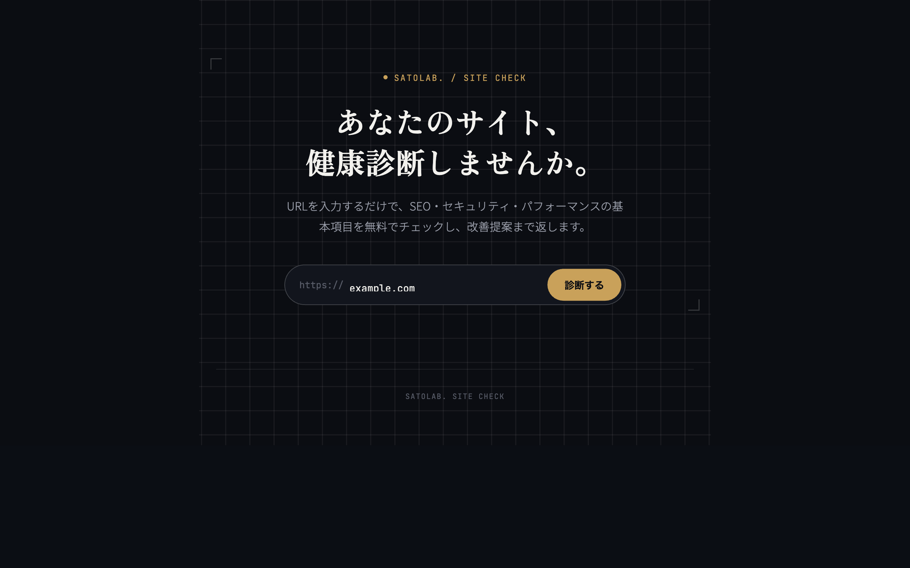

# Site Check — Frontend

Webサイト診断ツール「Site Check」のフロントエンドです。URLを入力すると[バックエンドAPI](https://github.com/yukisatodev/site-check-backend-)にリクエストを送り、SEO・セキュリティ・パフォーマンスのスコアと改善提案を表示します。

- 公開URL: https://effulgent-dodol-5d27d4.netlify.app/
- バックエンド: [site-check-backend](https://github.com/yukisatodev/site-check-backend-)（診断ロジック・API仕様はこちらに記載）




---

## 🎯 採用担当の方へ（30秒で分かる要約）

**これは何か**：URLを入力するだけでサイトの健康状態を診断し、結果を「数字の羅列」ではなく直感的に理解できる形で見せるツールのフロントエンドです。[実際に動かせます](https://effulgent-dodol-5d27d4.netlify.app/)。

このプロジェクトから伝わればと思っている点です。

- **UIを外部ライブラリに頼らず自作している**：スコアの円形ゲージはグラフライブラリを使わず、SVGの`stroke-dasharray`という仕組みだけで実装しています（[ScoreGauge.jsx](./src/ScoreGauge.jsx)）。仕組みを理解した上で必要な分だけ作る、という判断です。
- **「専門知識がない人にどう伝えるか」を設計の起点にしている**：企業向けのWeb制作・DX支援の実務経験から、「悪い点だけでなく良い点も含めて全体像を一目で把握できること」をUI設計の中心に据えました。エラーメッセージへの`role="alert"`付与など、アクセシビリティも要件として明文化しています。
- **要件を先に言語化してから作っている**：機能要件・非機能要件を表形式で整理し、対応状況を明示しています（下記「2. 要件定義」参照）。行き当たりばったりで作っていない点が伝わればと思います。
- **バックエンドと責務を分けて設計している**：診断ロジックは一切持たず、表示に専念しています。対になる[バックエンドのREADME](https://github.com/yukisatodev/site-check-backend-)も合わせてご覧いただくと、全体の設計判断がより伝わるかと思います。

---

## 1. 背景

バックエンド側で診断ロジックを実装しても、結果が「数字の羅列」のままではユーザーには伝わりません。企業向けにWeb制作・DX支援をしてきた経験から、**「悪い点を並べるだけでなく、良い点も含めて全体像を一目で把握できること」**をUI設計の中心に据えました。

## 2. 要件定義

### 2.1 想定ユーザー

バックエンドのREADMEと同一（個人開発者・小規模事業者・制作会社の営業担当）。ただしフロントエンドは特に「専門知識がなくても結果を理解できること」を優先している。

### 2.2 機能要件

| ID | 要件 | 対応状況 |
|---|---|---|
| F-1 | URLを入力して診断を実行できる（`https://`省略可） | ✅ |
| F-2 | 診断中であることが視覚的にわかる（スキャン演出） | ✅ |
| F-3 | パフォーマンス / SEO / セキュリティの3スコアを円形ゲージで表示する | ✅ |
| F-4 | 前回結果との差分がある場合、改善/悪化を示すバッジで表示する | ✅ |
| F-5 | 項目ごとの問題点と改善提案の一覧を表示する | ✅ |
| F-6 | 診断結果をPDFとしてダウンロードできる | ✅ |
| F-7 | 診断失敗時（存在しないURL等）にエラーメッセージを表示する | ✅ |

### 2.3 非機能要件

- **アクセシビリティ**: URL入力欄に`aria-label`、エラーメッセージに`role="alert"`を付与し、スクリーンリーダーでも診断結果の失敗が伝わるようにしている
- **一貫性**: [ポートフォリオサイト](https://yukisatodev.github.io/)と共通のデザイントークン（色・フォント）を使い、自分のプロダクト群として一貫したブランドイメージにする

## 3. 画面構成

| コンポーネント | 役割 |
|---|---|
| `App.jsx` | URL入力フォーム、診断リクエストの発行、状態管理（loading / error / result） |
| `ScoreGauge.jsx` | スコアを円形ゲージで表示。SVGの`stroke-dasharray`を使った自作コンポーネント |
| `FindingsList.jsx` | 診断結果の詳細（項目ごとのok/note/suggestion）を一覧表示 |
| `api.js` | バックエンドAPIとの通信（`fetch`のラッパー） |

画面遷移はなく、単一ページ内でフォーム→ローディング→結果表示が完結する構成。

## 4. 技術選定

| 技術 | 採用理由 |
|---|---|
| React + Vite | 学習中の技術を実務レベルのプロダクトに落とし込むため。Viteのビルド速度で開発中のフィードバックループを短縮 |
| 素のCSS（フレームワークなし） | ポートフォリオサイトと共通のデザイントークンを、外部ライブラリに縛られず細かく調整するため |
| Fetch API | 追加の通信ライブラリを持ち込まず、バックエンドとの通信をシンプルに保つため |

スコアのゲージ表示は外部グラフライブラリを使わず、SVGの`stroke-dasharray`で自作している。ポートフォリオサイトのスキルレーダーチャートを作った経験を、別プロダクトのUIに転用した形。

## 5. セットアップ

```bash
npm install
npm run dev
```

`http://127.0.0.1:5173` が開く。バックエンドのURLを変更したい場合は`.env`に以下を設定する。

```
VITE_API_BASE_URL=http://127.0.0.1:8000
```

## 6. デプロイ

Netlifyで`npm run build`の`dist/`を公開。環境変数`VITE_API_BASE_URL`にはビルド時に値が埋め込まれるため、本番バックエンドURL（Render）を変更した場合は再デプロイが必須。

## 7. 今後の課題

- 診断履歴のグラフ表示（推移を折れ線グラフなどで可視化）
- ダークモード以外のテーマ切り替え
- モバイル表示のさらなる最適化
